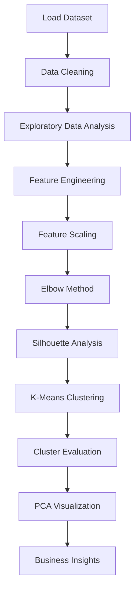

<div align="center">

# 🛍️ Customer Segmentation using K-Means Clustering

### SkillCraft Technology Machine Learning Internship — Task 02

Machine Learning Project for Customer Segmentation using **K-Means Clustering**, **PCA**, **EDA**, and **Business Insights**

</div>

---

<p align="center">


</p>


## 📊 Customer Segmentation


A machine learning project that segments mall customers into meaningful groups using the **K-Means Clustering** algorithm.

---

## 📌 Table of Contents

- Overview
- Project Objectives
- Dataset
- Technologies Used
- Project Workflow
- Exploratory Data Analysis
- Data Preprocessing
- Model Building
- Model Evaluation
- Visualizations
- Business Insights
- Results
- Project Structure
- Installation
- Future Improvements
- Author

---

## 📖 Overview

Customer segmentation is a fundamental marketing strategy used to divide customers into groups with similar characteristics. Businesses can use these groups to design personalized marketing campaigns, improve customer satisfaction, and increase revenue.

In this project, the **K-Means Clustering** algorithm is used to segment customers based on:

- Gender
- Age
- Annual Income
- Spending Score

The optimal number of clusters was determined using the **Elbow Method** and **Silhouette Score**, ensuring that the segmentation is both data-driven and easy to interpret.

---

## 🎯 Project Objectives

- Perform exploratory data analysis (EDA).
- Understand customer demographics and spending behavior.
- Prepare data using feature engineering and standardization.
- Determine the optimal number of clusters.
- Build a K-Means clustering model.
- Evaluate clustering performance using multiple metrics.
- Visualize customer segments.
- Provide business recommendations for each customer group.


---

## 📂 Dataset

**Dataset Name:** Mall Customers Dataset

**Source:** https://www.kaggle.com/datasets/vjchoudhary7/customer-segmentation-tutorial-in-python

### Dataset Features

| Feature | Description |
|----------|-------------|
| CustomerID | Unique customer identifier |
| Gender | Male/Female |
| Age | Customer age |
| Annual Income (k$) | Annual income in thousand dollars |
| Spending Score (1-100) | Customer spending score assigned by the mall |

**Dataset Size**

- Rows: **200**
- Columns: **5**

---

## 🛠️ Technologies Used

| Category | Tools |
|----------|-------|
| Programming Language | Python |
| Data Analysis | Pandas, NumPy |
| Data Visualization | Matplotlib, Seaborn, Plotly |
| Machine Learning | Scikit-learn |
| Dimensionality Reduction | PCA |
| Notebook | Jupyter Notebook |
| Version Control | Git & GitHub |

---

## 🚀 Built With


---

## 🔄 Project Workflow


---


## 📊 Model Evaluation

| Metric | Value |
|---------|------:|
| Algorithm | K-Means Clustering |
| Optimal Number of Clusters | 5 |
| Silhouette Score | **0.xxx** |
| Davies-Bouldin Index | **x.xxx** |
| Calinski-Harabasz Score | **xxx.xx** |

The optimal number of clusters was selected using the **Elbow Method** and **Silhouette Score**. Although the silhouette score increased for larger values of K, **K = 5** was chosen because it provides the best balance between clustering performance and business interpretability.


## 📈 Key Results

- Successfully segmented customers into **5 meaningful clusters**.
- Applied feature scaling using **StandardScaler**.
- Determined the optimal number of clusters using the **Elbow Method** and **Silhouette Score**.
- Evaluated clustering quality using three performance metrics.
- Generated customer personas and business recommendations for each cluster.


## 📈 Results Summary

| Item | Result |
|------|--------|
| Dataset | Mall Customers |
| Samples | 200 |
| Features | 5 |
| Algorithm | K-Means |
| Optimal Clusters | 5 |
| Scaling | StandardScaler |
| Visualization | PCA |
| Evaluation | Silhouette + Davies-Bouldin + Calinski-Harabasz |

## 📷 Project Visualizations

### Customer Segmentation


---

### Elbow Method


---

### PCA Visualization


---

### Correlation Heatmap


## 💼 Business Insights

The clustering analysis identified multiple customer groups with distinct purchasing behaviors.

### Business Recommendations

- 🎯 Offer premium memberships to high-income, high-spending customers.
- 🎁 Provide discounts and loyalty rewards for regular customers.
- 📢 Target high-income, low-spending customers with personalized promotions.
- 🛍️ Design budget-friendly campaigns for low-income customer segments.
- 📈 Use customer segmentation to improve marketing efficiency and increase customer retention.

- 
---

# 🚀 Installation

Clone the repository:

```bash
git clone https://github.com/thodetivarshith/SCT_ML_Task02_CustomerSegmentation.git
```

Navigate to the project folder:

```bash
cd SCT_ML_Task02_CustomerSegmentation
```

Install the required dependencies:

```bash
pip install -r requirements.txt
```

Launch Jupyter Notebook:

```bash
jupyter notebook
```

Open:

```
Customer_Segmentation.ipynb
```

---


# 📁 Project Structure

```
SCT_ML_Task02_CustomerSegmentation
│
├── data/
│   └── Mall_Customers.csv
│
├── images/
│   ├── age_distribution.png
│   ├── annual_income_distribution.png
│   ├── spending_score_distribution.png
│   ├── gender_distribution.png
│   ├── boxplot_age.png
│   ├── boxplot_income.png
│   ├── boxplot_spending.png
│   ├── correlation_heatmap.png
│   ├── pairplot.png
│   ├── elbow_method.png
│   ├── silhouette_score.png
│   ├── customer_clusters.png
│   ├── pca_clusters.png
│
├── Customer_Segmentation.ipynb
├── clustered_customers.csv
├── cluster_profile.csv
├── requirements.txt
├── README.md
├── LICENSE
└── .gitignore
```

---


# 🚀 Future Improvements

- Implement DBSCAN clustering.
- Compare with Agglomerative Clustering.# 👨‍💻 Author

**Varshith Thodeti**

🎓 B.Tech – Computer Science and Engineering (AI & ML)

🏫 Noida International University

💼 Machine Learning Intern at SkillCraft Technology

🔗 GitHub:
https://github.com/thodetivarshith

🔗 LinkedIn:
https://www.linkedin.com/in/thodeti-varshith/
- Build an interactive Streamlit dashboard.
- Deploy the project using Streamlit Cloud.
- Integrate customer recommendation techniques.
- Support real-time customer segmentation.
- Expand the model using additional customer behavior features.

---


---

⭐ If you found this project helpful, consider giving it a **Star** on GitHub.

This project was developed for educational purposes as part of the **SkillCraft Technology Machine Learning Internship**.

---

## ✨ Project Highlights

- ✔️ Data Cleaning
- ✔️ Exploratory Data Analysis
- ✔️ Feature Engineering
- ✔️ StandardScaler
- ✔️ Elbow Method
- ✔️ Silhouette Analysis
- ✔️ K-Means Clustering
- ✔️ PCA Visualization
- ✔️ Interactive Plotly Charts
- ✔️ Business Insights
- ✔️ Customer Personas

## 📚 Learning Outcomes

During this project, I gained practical experience in:

- Customer Segmentation
- Unsupervised Machine Learning
- Feature Scaling
- Cluster Evaluation
- PCA
- Business Analytics
- Data Visualization
- Git & GitHub

## 📌 Repository Information

| Category | Details |
|----------|---------|
| Internship | SkillCraft Technology |
| Task | Task 02 |
| Domain | Machine Learning |
| Project Type | Unsupervised Learning |
| Status | Completed |

---

<div align="center">

### ⭐ Thank you for visiting this repository!

If you found this project useful, consider giving it a ⭐ on GitHub.

</div>

---


